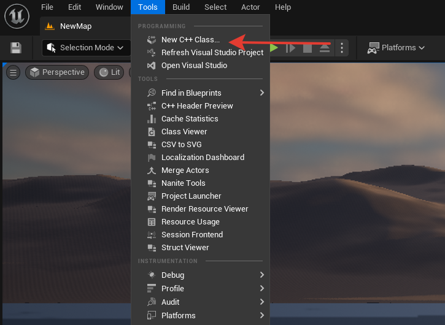
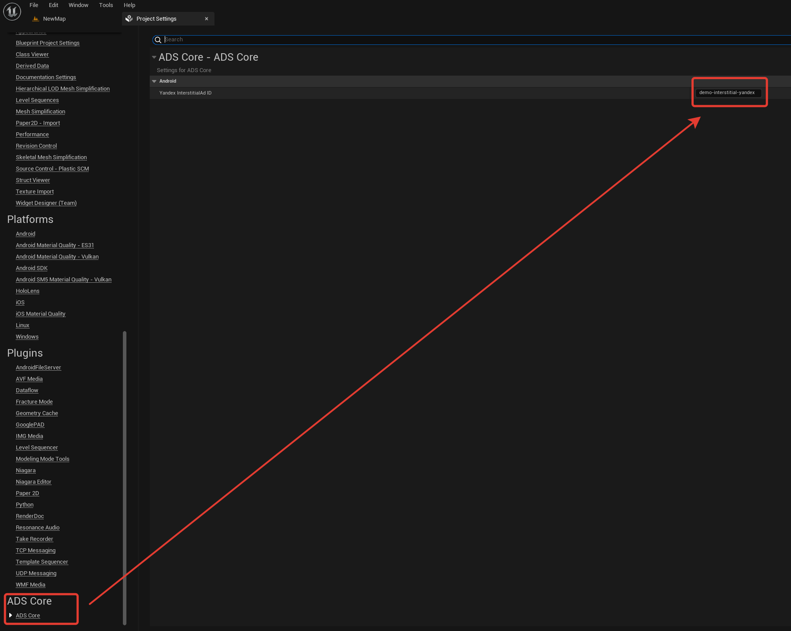
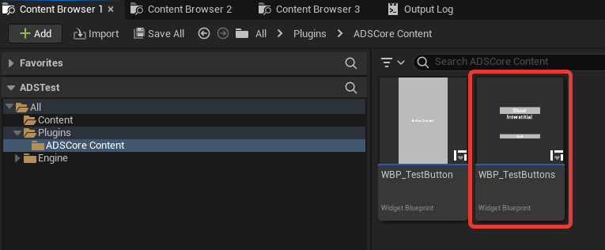
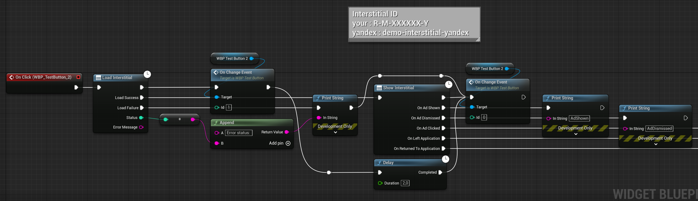
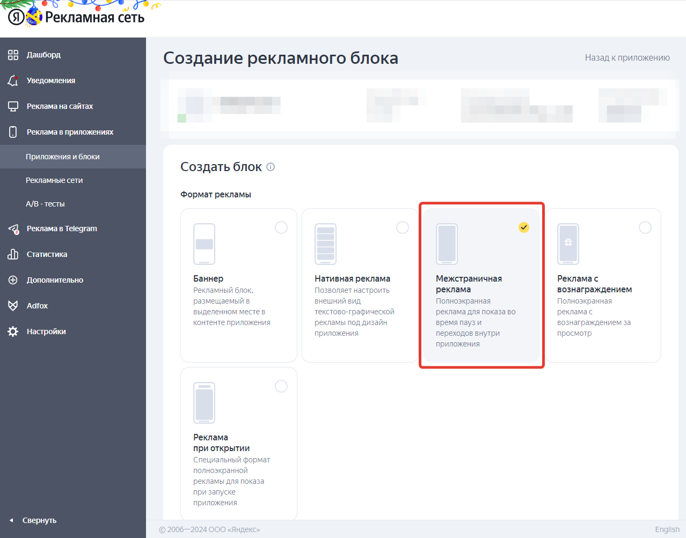
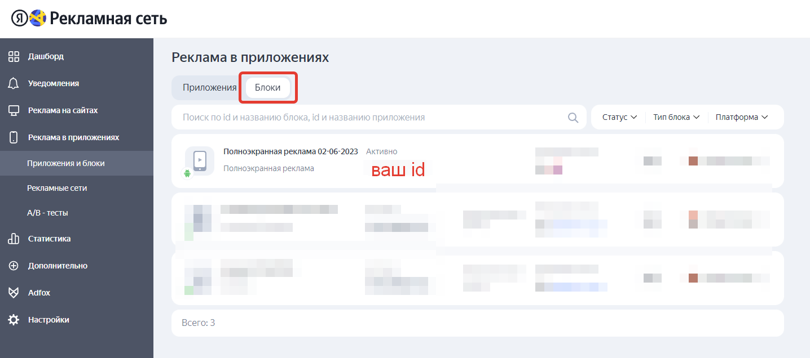

<h1 align="center">Hello everyone, we <a href="https://boosty.to/adscore/" target="_blank">VOORHU</a>, present to you ADSCore Lite</h1>

  
# Documentation

### This plugin was created for easy integration of Yandex advertising into Unreal Engine projects.

### Supported platforms: Android

### Supported versions of Unreal Engine: 5.2

### For all questions, you can write here: voidrosegd@gmail.com

### Video instruction *[YouTube](https://youtu.be/S0Yz6SVNjcE)*.

# Installation

## Adding to a project

### Create a Plugins folder in the root of your project if it doesn't already exist.

### Unzip the contents of the archive with the plugin into it.

### The project used must be C++ or add Source files to your Blueprint project.

### To add source files, open the Tools context menu and choose New C++ Class.

### Close the IDE after opening it and restart the project, you can continue with the installation.

## Setup and functionality

### Let's go to the project settings and specify YOUR ad network ID.
>You cannot use the same ID for multiple applications!
>
>For each application, you need to create a separate identifier associated with a specific application.
>
>Test identifier demo-interstitial-yandex
>
>[Creating a Yandex ID](#creating-a-yandex-id)⏬

### The plugin comes with a test widget WBP_TestButtons, you may need to enable the display of plugins.

### Open it and go to the Graph section, here we left the option of using the plugin functionality.

## Creating a Yandex ID

### Let's go to *[website](https://partner.yandex.ru)* YAN.

### After registration, you will be taken to the Dashboard.

### Go to Ads in Apps -> App & Blocks.

### Add your application following the instructions from Yandex.

### After adding the application, you will have the opportunity to create an ad unit.

### Our plugin works with Full Screen Ads, so create a block of this type.

### The created block will appear in the Blocks section.

### In the Blocks section, you can see information for all your blocks, including the advertising ID.

### You can read more about working with YAN *[here](https://yandex.ru/support/partner/)*.
