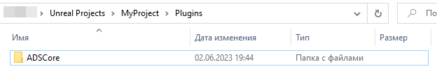
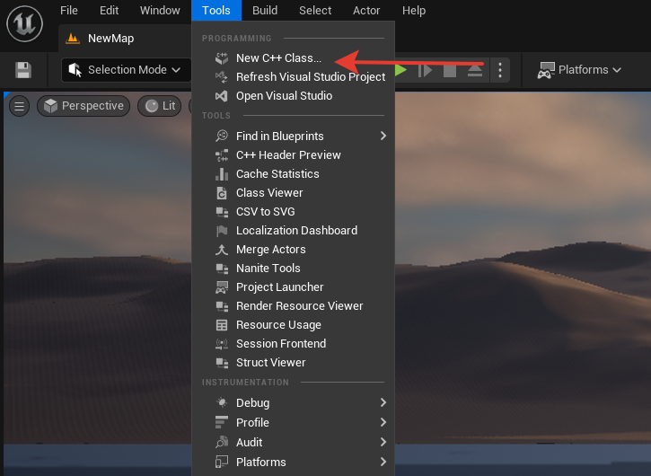
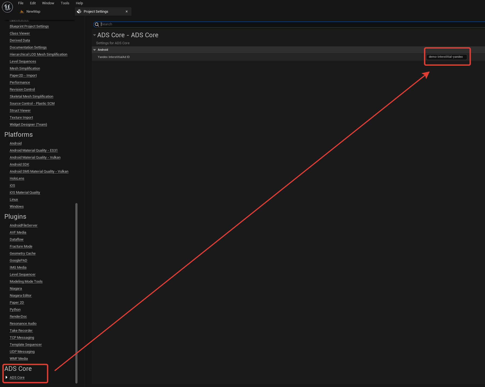
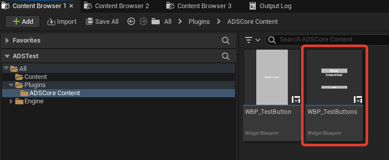
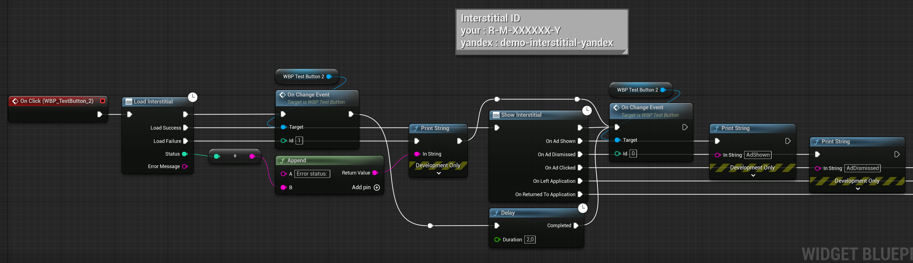
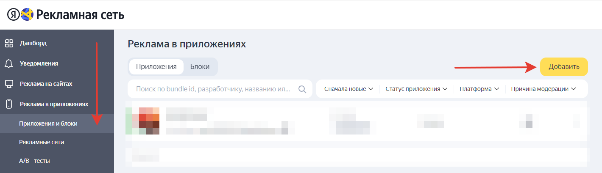
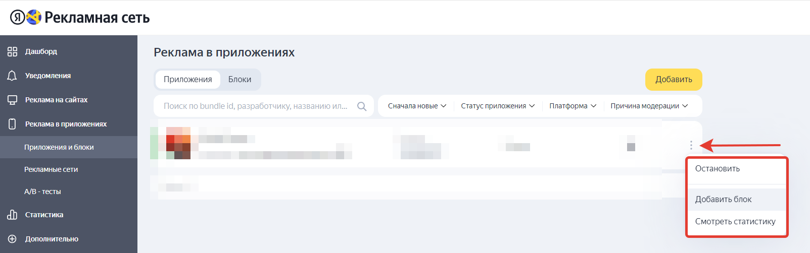
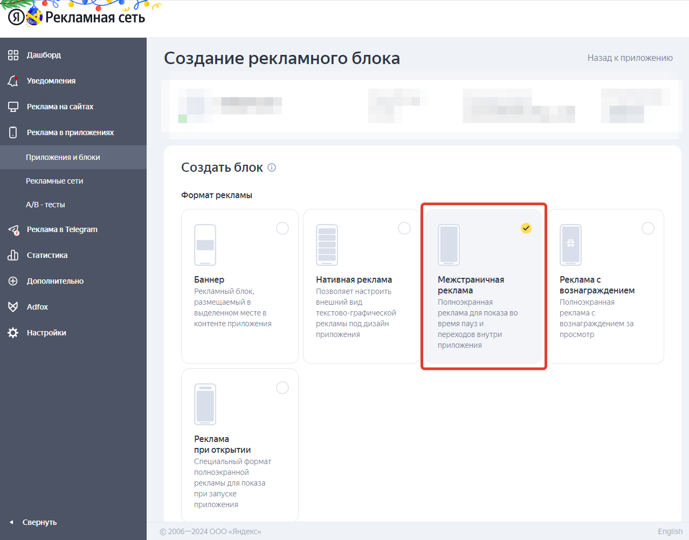
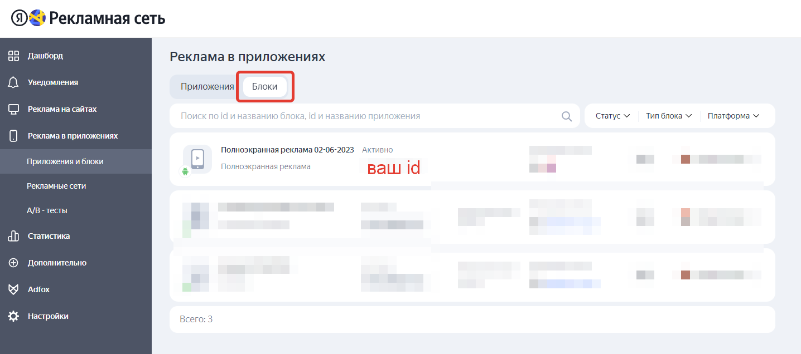

<h1 align="center">Всем привет, мы <a href="https://boosty.to/adscore/" target="_blank">VOORHU</a>, представляем вам ADSCore Lite</h1>

  
# Документация

### Этот плагин создан для легкой интеграции Яндекс рекламы в проекты на Unreal Engine.

### Поддерживаемые платформы: Android, IOS(КТТС)

### Поддерживаемые версии Unreal Engine: 5.2, 4.27(КТТС)

### По всем вопросам можете писать сюда: voorhu@gmail.com

### Видео инструкция на *[YouTube](https://youtu.be/S0Yz6SVNjcE)*.

# Установка

## Добавление в проект

### Создайте в корне вашего проекта папку Plugins если её ещё нету.

### Разархивируйте в неё содержимое архива с плагином.

### Используемый проект должен быть С++ или добавьте Source файлы в свой Blueprint проект.

> Можно так же просто поместить плагин по этому пути ..\Epic Games\UE_5.2\Engine\Plugins\Marketplace

### Для добавления source файлов, откройте контекстное меню Tools и выберите New C++ Class. 

### Закройте IDE после её открытия и перезапустите проект, можно продолжать установку.

## Настройка и функционал

### Перейдем в настройки проекта и укажем ВАШ идентификатор рекламной сети. 
>Вы не можете использовать один идентификатор для нескольких приложений!
>
>Для каждого приложения нужно создавать отдельный идентификатор, привязанный к конкретному приложению.
>
>Тестовый идентификатор demo-interstitial-yandex
>
>[Создание идентификатора Яндекс](#создание-идентификатора-яндекс)⏬

### В комплекте с плагином идёт тестовый виджет WBP_TestButtons, возможно понадобится включить отображение плагинов.

### Откройте его и перейдите в раздел Graph, тут мы оставили вариант использования функционала плагина.

## Создание идентификатора Яндекс

### Перейдем на *[сайт](https://partner.yandex.ru)* РСЯ.

### После регистрации вы попадете в Дашборд.

### Перейдите в раздел Реклама в приложениях -> Приложение и блоки.

### Добавьте своё приложение, следуя инструкциям от Яндекса.

### После добавления приложения, у вас появится возможность создать рекламный блок.

### Наш плагин работает с Полноэкранной рекламой, поэтому создайте блок данного типа.

### Созданный блок появится в разделе Блоки.
### В разделе Блоки вы можете наблюдать информацию по всем своим блокам, включая рекламный идентификатор.

### Подробнее о работе с РСЯ можно почитать *[тут](https://yandex.ru/support/partner/)*.

# Список возможных ошибок

# F.A.Q.
